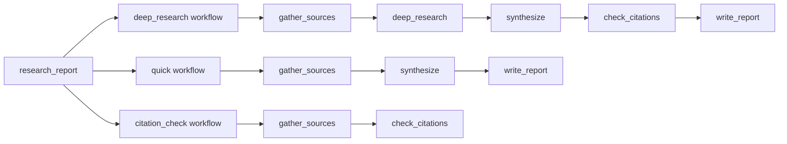
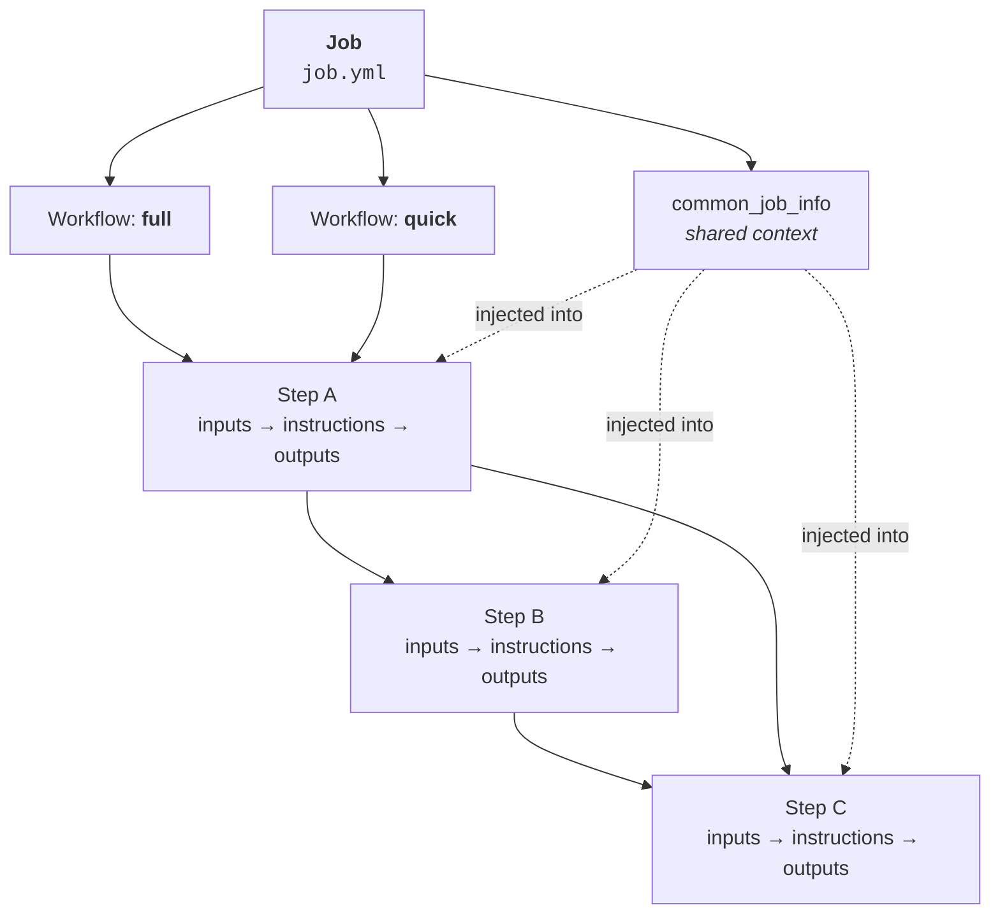
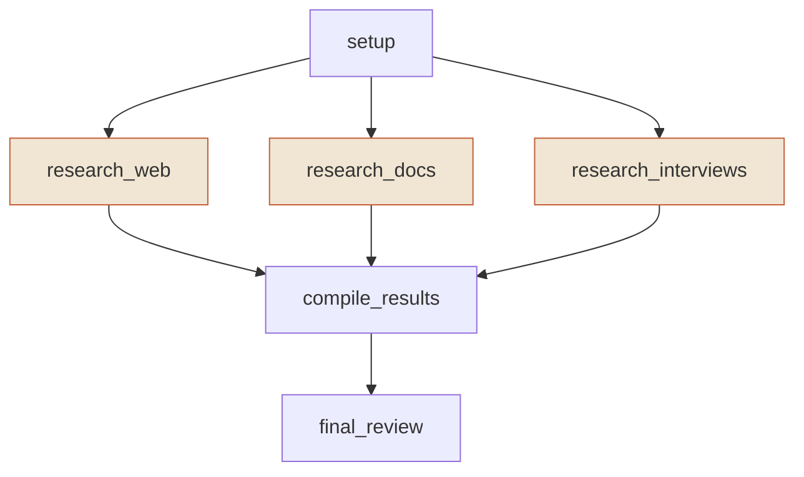
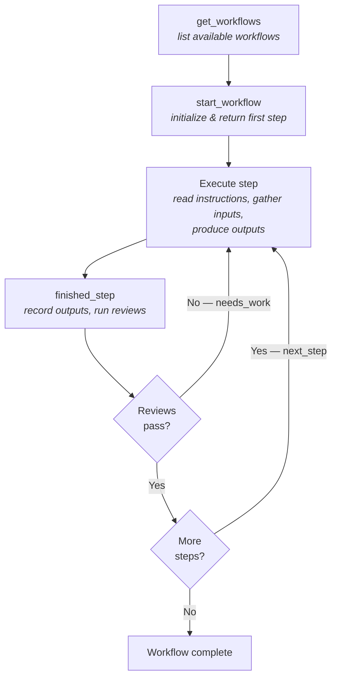

# Core Concepts

DeepWork automates multi-step workflows by decomposing complex tasks into reviewable steps. Three concepts form the mental model: **Jobs**, **Steps**, and **Workflows**.

```
Job (e.g., "research_report")
├── Steps: [gather_sources, deep_research, synthesize, check_citations, write_report]
└── Workflows:
    ├── "deep_research"      → [gather_sources, deep_research, synthesize, check_citations, write_report]
    ├── "quick"              → [gather_sources, synthesize, write_report]
    └── "citation_check"     → [gather_sources, check_citations]
```



A **Job** defines a pool of **Steps** and one or more **Workflows** — named paths through those steps. Different workflows reuse the same steps in different combinations. The `deep_research` workflow runs every step; `quick` skips the deep dive and citation check; `citation_check` validates sources without writing a report.

## Jobs

A job is the top-level container. It lives in `.deepwork/jobs/<name>/job.yml` and defines everything needed to execute a task: the steps, the workflows, and shared context.

```yaml
name: fruits
version: "1.0.0"
summary: "Identify and classify fruits from a mixed list of items"
common_job_info_provided_to_all_steps_at_runtime: |
  A simple, deterministic job for CI testing of the DeepWork framework.
```

Key fields:

- **name** — Unique identifier for the job
- **summary** — What the job does
- **common_job_info_provided_to_all_steps_at_runtime** — Shared context injected into every step so the AI agent understands the broader goal
- **steps** — The atomic units of work (see below)
- **workflows** — Named execution paths through steps (see below)

## Steps

A step is the atomic unit of work. Each step has instructions (a markdown file), defined inputs, defined outputs, and optional quality reviews.

```yaml
steps:
  - id: identify
    name: "Identify Fruits"
    description: "Filter a list of items to identify only the fruits"
    instructions_file: steps/identify.md
    inputs:
      - name: raw_items
        description: "Comma-separated list of items to filter"
    outputs:
      identified_fruits.md:
        type: file
        description: "List of identified fruits from the input items"
        required: true
    dependencies: []
    reviews: []
```

### Inputs

Inputs can come from two sources:

- **User-provided** — The user supplies a value when the step runs (`name:` + `description:`)
- **From a prior step** — A file produced by an earlier step (`file:` + `from_step:`)

```yaml
inputs:
  - name: market_segment            # user provides this
    description: "The market segment to analyze"
  - file: identified_fruits.md      # comes from a prior step
    from_step: identify
```

### Outputs

Outputs are files that the step produces. They can feed into later steps as inputs.

```yaml
outputs:
  classified_fruits.md:
    type: file
    description: "Fruits organized into categories"
    required: true
```

### Dependencies

The `dependencies` list declares which steps must complete before this step can run. This is how DeepWork knows the execution order.

## Workflows

A workflow is a named execution path through a job's steps. One job can have multiple workflows — for example, a `full_analysis` workflow that runs everything, and a `quick_check` that runs a subset.

```yaml
workflows:
  - name: full
    summary: "Run the complete fruits identification and classification"
    steps:
      - identify
      - classify
```

Workflows are what you invoke:

```
/deepwork fruits full
```

### Concurrent Steps

Steps can run in parallel by wrapping them in an array within the workflow's step list:

```yaml
workflows:
  - name: full_analysis
    summary: "Complete analysis with parallel research phase"
    steps:
      - setup
      - [research_web, research_docs, research_interviews]  # these run concurrently
      - compile_results
      - final_review
```

In this example, `setup` runs first, then the three research steps run in parallel, then `compile_results` runs after all three finish.

## Quality Gates

Steps can define review criteria. After the AI agent finishes a step, its outputs are evaluated against these criteria. If criteria fail, the agent gets feedback and retries.

```yaml
reviews:
  - run_each: job_yml
    quality_criteria:
      "Job Structure": "Does the job.yml define the expected steps with correct dependencies?"
      "Outputs Defined": "Does the step have the required output files?"
```

Reviews enforce quality without human intervention — the AI agent iterates until the work meets the defined standard.

## Putting It Together

Here's how Jobs, Workflows, and Steps relate:



The `fruits` job demonstrates the sequential pattern — two steps (`identify` → `classify`) and one workflow (`full`). The identify step takes user input, produces a file, and the classify step consumes that file.

The `concurrent_workflow` job demonstrates parallel execution:



The three research steps run concurrently after setup, then their outputs are compiled into a final report.

## What Happens When You Run a Workflow



1. **get_workflows** — DeepWork lists available workflows for the job
2. **start_workflow** — You pick a workflow; DeepWork initializes it and returns the first step(s)
3. **Execute step** — The AI agent reads the step's instructions, gathers inputs, and produces outputs
4. **finished_step** — DeepWork records the outputs and runs any quality reviews
5. **Next step or retry** — If reviews pass, DeepWork advances to the next step(s). If reviews fail, the agent gets feedback and retries the current step
6. **Complete** — When all steps in the workflow finish, the workflow is complete
